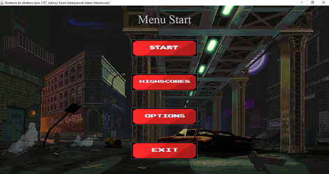
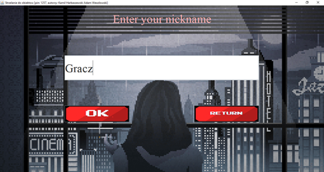
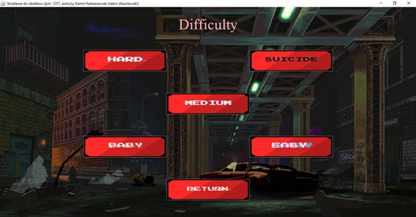
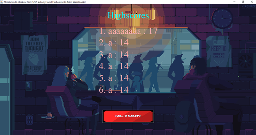
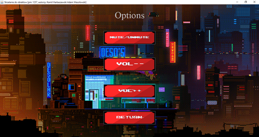
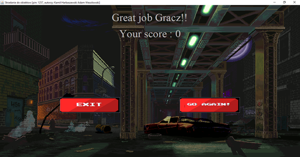
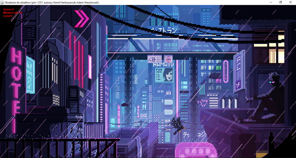

## ArcadeShooter

Instrukcja użytkownika gry zręcznościowej  

Wykonali:  
Adam Wesołowski  
Kamil Harbaszewski 

Ekran startowy (menu)  

Użytkownik ma do wyboru 4 opcje:  

-Opcja „Start” przenosi użytkownika do kolejnego okna gry w którym wybiera swój nazwę (nick).
	(okno wyboru nazwy/nicku)
-Użytkownik może wprowadzić swoją nazwę(nick) która będzie później wpisana na tablicy Highscores jeśli otrzyma odpowiednio wysoki wynik, może także powrócić do Menu głównego używając przycisku Return. Po zaakceptowaniu nazwy użytkownik przechodzi automatycznie do okna wyboru trudności gry

-Użytkownik ma do wyboru odpowiednio od wylosowanego parametru od 2 do 5 poziomów trudności.
-Baby -Nie zdobywa się pkt ,obiekty do których strzelamy nie maleją z upływem gry a także nie przyśpieszają (tryb treningowy)
-Easy – Defaultowy tryb gry za każdy strzał zdobywamy 1 pkt. Obiekty do których strzelamy przyśpieszają z każdym trafieniem a co 16 trafień zmniejszają swój rozmiar.
-Medium- tryb gry w którym za każdy strzał zdobywamy 1 pkt + współczynnik (zależny od parametrów z pobranego pliku). Obiekty do których strzelamy przyśpieszają bardziej niż w trybie Easy a co 16 trafień zmniejszają swój rozmiar(zmiana rozmiaru bardziej widoczna niż przypadku trybu Easy).
-Hard-Tryb gry podobnie jak w Medium dostajemy jeszcze więcej pkt ale także gra staje się jeszcze trudniejsza.
-Sucide =Tryb gry dwukrotnie trudniejszy niż hard ale wynagradzany dwukrotnie większą ilością punktów w porównaniu do trybu Hard.
Po wybraniu poziomu trudności jesteśmy przenoszeni do okna z grą (opisane niżej)

-Opcja „Highscores” przenosi użytkownika do innego okna w którym ukazuje mu się toplista 7 graczy (nazwy wraz z ich wynikami).Użytkownik w każdej chwili może powrócić z okna Highscores do okna Menu za pośrednictwem przycisku „Return” umiejscowionego w dolnej części ekranu.

-Opcja „Options” przenosi użytkownika do okna kontroli dźwięku. 
Użytkownik używając przycisku „Mute/UnMute” w dowolnej chwili może zapauzować muzykę i odpauzować w momencie w którym została wcześniej zapauzowana. Użytkownik także ma możliwość ściszenia lub podgłaśniania muzyki w tle. Ma także możliwość powrotu do Menu głównego za pośrednictwem przycisku Return.

-Opcja „Exit” zamknięcie gry.
Jeśli wykorzystamy wszystkie możliwe chybienia użytkownik zostaje przekierowany do ekranu końcowego z którego może wybrać wykonanie kolejnej rozgrywki (opcja Go again!) lub wyjść z gry (opcja Exit na obrazku poniżej).

# Gra  
Zasady: Gracz posiada 10 żyć (możliwych nietrafionych celów). Gra kończy się w momencie którym gracz straci wszystkie swoje życia (spudłuje 10 razy) lub jeśli gra w trybie Baby skończy się jego czas 100s.
Gracz zdobywa punkty za strzały trafione w poruszające się po ekranie obiekty. Na podstawie poziomu trudności a także liczby trafień gra staje się trudniejsza. Każde trafienie przyśpiesza obiekt na ekranie a co 16 trafionych strzałów gra przechodzi na kolejny poziom trudności zmniejszając rozmiar obiektów gry.
W lewym górnym rogu okna z grą gracz ma wyświetloną liczbę punktów jakie posiada także liczbę pozostałych żyć (strzałów możliwych do spudłowania) i również poziom na jakim aktualnie się znajduje.

